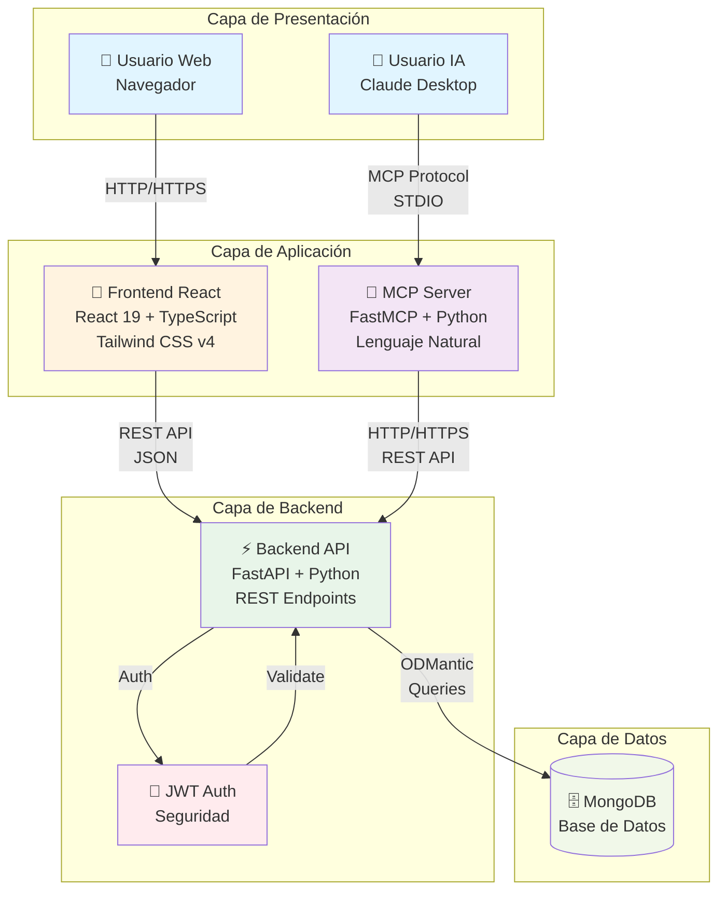
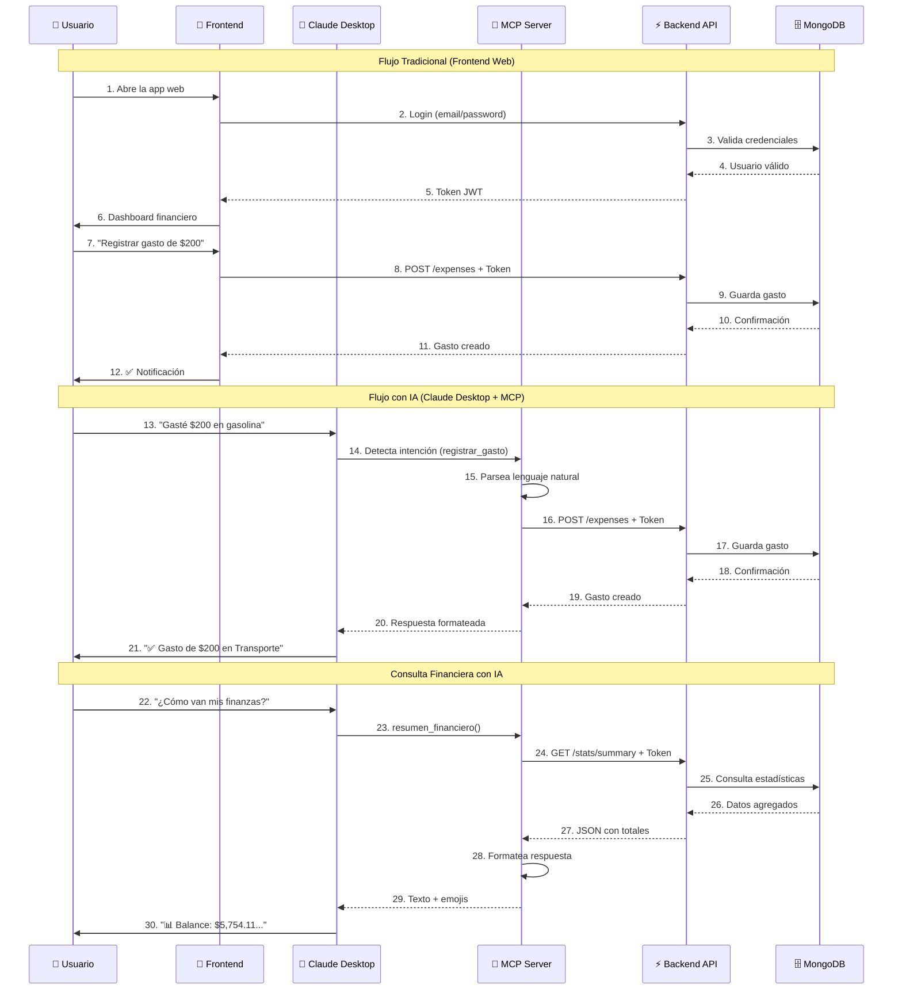

# 🏦 Control de Gastos App

**Sistema completo de gestión de finanzas personales** desarrollado con tecnologías modernas y arquitectura escalable.

<div align="center">
  


</div>

## 🎯 Descripción

Una aplicación completa para el control de finanzas personales que permite a los usuarios gestionar sus gastos, ingresos y ahorros de manera eficiente. El proyecto incluye tres componentes totalmente funcionales:

- **Backend API** (✅ Completado) - FastAPI + MongoDB
- **Frontend Web** (✅ Completado) - React + TypeScript + Tailwind CSS
- **MCP Server** (✅ Completado) - Integración con Claude Desktop para interacción en lenguaje natural

## 🏗️ Arquitectura del Sistema

### Diagrama de Componentes



### Flujo de Uso



## 📁 Estructura del Proyecto

```
control-gastos-app/
├── backend/               # ✅ API Backend (FastAPI + MongoDB)
│   ├── api/              # Endpoints REST
│   ├── core/             # Configuración y seguridad
│   ├── db/               # Conexión a base de datos
│   ├── models/           # Modelos y esquemas
│   ├── services/         # Lógica de negocio
│   ├── main.py           # Aplicación principal
│   └── README.md         # Documentación del backend
├── frontend/             # ✅ Interfaz Web (React + TypeScript)
│   ├── src/
│   │   ├── components/   # Componentes reutilizables
│   │   ├── pages/        # Páginas de la aplicación
│   │   ├── services/     # Servicios API
│   │   ├── store/        # Estado global (Zustand)
│   │   ├── types/        # Tipos TypeScript
│   │   └── lib/          # Configuraciones (Axios)
│   └── README.md         # Documentación del frontend
├── mcp/                  # ✅ Model Context Protocol
│   ├── src/
│   │   ├── server.py     # Servidor MCP con FastMCP
│   │   ├── utils/        # Utilidades y helpers
│   │   └── llm_prompts/  # Prompts para categorización
│   ├── pyproject.toml    # Dependencias del MCP
│   └── README.md         # Documentación MCP
└── README.md             # Este archivo
```

## 🚀 Características Implementadas

### ✅ Backend API
- **Autenticación JWT** completa (registro, login, perfil)
- **Gestión de gastos** con categorías y tipos de pago
- **Control de ingresos** con fuentes personalizables
- **Seguimiento de ahorros** con metas y propósitos
- **Estadísticas financieras** y reportes mensuales
- **Seguridad robusta** con validaciones y encriptación
- **Documentación automática** con Swagger/OpenAPI
- **Arquitectura limpia** con separación de responsabilidades

### ✅ Frontend Web
- **Autenticación completa** (Login/Registro con validación)
- **Diseño mobile-first** optimizado para dispositivos móviles
- **Dashboard financiero** con resumen de balance, gastos, ingresos y ahorros
- **Navegación inferior** para acceso rápido en móviles
- **Sistema de rutas protegidas** con React Router
- **Componentes reutilizables** (Button, Input, Card, Layout)
- **Estado global** con Zustand para manejo de autenticación
- **Integración completa** con backend API mediante Axios
- **Notificaciones toast** para feedback inmediato
- **Animaciones y transiciones** suaves
- **Tema personalizado** con Tailwind CSS v4

### 🚧 En Desarrollo
- **Páginas CRUD** para gestión completa de gastos, ingresos y ahorros
- **Visualizaciones** con gráficos y estadísticas
- **Perfil de usuario** con edición de datos
- **Filtros y búsquedas** avanzadas
- **PWA features** para instalación como app
- **FastMCP** - Framework MCP para Python
- **tzdata** - Manejo de zonas horarias
- **python-dateutil** - Conversión de fechas

## 🛠️ Tecnologías

### Backend
- **FastAPI** - Framework web moderno y rápido
- **MongoDB** - Base de datos NoSQL flexible
- **ODMantic** - ODM moderno para MongoDB
- **Pydantic** - Validación de datos con tipos
- **JWT** - Autenticación con tokens
- **Scrypt** - Hash seguro de contraseñas
- **Uvicorn** - Servidor ASGI de alta performance

### Frontend
- **React 19** - Framework de interfaz de usuario
- **TypeScript** - Tipado estático para mayor seguridad
- **Vite** - Build tool ultrarrápido
- **Tailwind CSS v4** - Framework de estilos utility-first
- **React Router v7** - Navegación y rutas
- **Zustand** - Estado global ligero
- **Axios** - Cliente HTTP con interceptores
- **React Hot Toast** - Sistema de notificaciones
- **Lucide React** - Iconos modernos
- **date-fns** - Manipulación de fechas
- **Recharts** - Gráficos y visualizaciones (planificado)

### MCP Server
- **FastMCP** - Framework simplificado para servidores MCP
- **httpx** - Cliente HTTP asíncrono para comunicación con backend
- **pydantic** - Validación de datos
- **python-dotenv** - Gestión de variables de entorno
- **tzdata** - Soporte para zonas horarias
- **Claude Desktop** - Cliente MCP oficial de Anthropic

## 🏃‍♂️ Inicio Rápido

### Prerequisitos
- Python 3.11+
- Node.js 18+ y npm
- MongoDB 6.0+
- Git

### 1. Clonar el repositorio
```bash
git clone https://github.com/sergiodev3/control-gastos-app.git
cd control-gastos-app
```

### 2. Configurar el Backend
```bash
cd backend

# Crear entorno virtual
python -m venv .venv

# Activar entorno virtual
.venv\Scripts\activate  # Windows
# source .venv/bin/activate  # Linux/macOS

# Instalar dependencias
pip install -r requeriments.txt

# Configurar variables de entorno (copiar y editar .env.example)
cp .env.example .env

# Iniciar servidor
uvicorn main:app --reload
```

Backend disponible en: `http://localhost:8000`  
Documentación API: `http://localhost:8000/docs`

### 3. Configurar el Frontend
```bash
cd frontend

# Instalar dependencias
npm install

# Configurar variables de entorno
cp .env.example .env

# Iniciar servidor de desarrollo
npm run dev
```

Frontend disponible en: `http://localhost:5173`

### 4. Configurar el MCP Server (Opcional - para Claude Desktop)
```bash
cd mcp

# Crear entorno virtual
python -m venv .venv

# Activar entorno virtual
.venv\Scripts\activate  # Windows

# Instalar dependencias
pip install fastmcp httpx pydantic python-dotenv tzdata

# Configurar variables de entorno
cp .env.example .env
# Editar .env con tu API_TOKEN del backend

# Probar servidor
cd src
python server.py
```

**Para usar con Claude Desktop:**
Ver documentación completa en [MCP README](./mcp/README.md)

## 📚 Documentación Detallada

- [📖 Documentación del Backend](./backend/README.md) - API REST con FastAPI
- [🎨 Documentación del Frontend](./frontend/README.md) - App web con React
- [🤖 Documentación del MCP Server](./mcp/README.md) - Integración con Claude Desktop

## 🧪 Probar la API

### Endpoints Principales

#### 🔐 Autenticación
```bash
# Registrar usuario
POST http://localhost:8000/api/v1/auth/register
{
  "email": "usuario@example.com",
  "username": "miusuario",
  "full_name": "Mi Nombre",
  "password": "password123"
}

# Iniciar sesión
POST http://localhost:8000/api/v1/auth/login
{
  "email": "usuario@example.com", 
  "password": "password123"
}
```

#### 💸 Gestión Financiera
```bash
# Crear gasto
POST http://localhost:8000/api/v1/expenses
Authorization: Bearer <token>
{
  "description": "Supermercado",
  "amount": 150.75,
  "payment_type": "tarjeta_debito",
  "category": "Alimentación"
}

# Ver estadísticas
GET http://localhost:8000/api/v1/stats/summary
Authorization: Bearer <token>
```

## 🎨 Capturas de Pantalla

### API Documentation (Swagger)


### Frontend (Próximamente)


## 🗺️ Roadmap

### ✅ Fase 1 - Backend API (Completado)
- [x] Arquitectura base con FastAPI
- [x] Autenticación JWT completa
- [x] CRUD completo de gastos, ingresos y ahorros
- [x] Estadísticas y reportes mensuales
- [x] Documentación automática (Swagger)
- [x] Manejo de zonas horarias

### ✅ Fase 2 - Frontend Web (Completado)
- [x] Interfaz de usuario moderna y responsive
- [x] Dashboard financiero con resúmenes
- [x] Sistema de autenticación (Login/Registro)
- [x] Gestión completa de gastos, ingresos y ahorros
- [x] Navegación mobile-first
- [x] Componentes reutilizables con Tailwind CSS v4
- [x] Estado global con Zustand

### ✅ Fase 3 - MCP Integration (Completado)
- [x] Servidor MCP con FastMCP
- [x] Integración con Claude Desktop
- [x] 10 herramientas para gestión financiera
- [x] Categorización automática inteligente
- [x] Consultas en lenguaje natural
- [x] Soporte de timezone (America/Mexico_City)
- [x] Documentación completa con ejemplos

### 🚀 Fase 4 - Características Avanzadas
- [ ] Aplicación móvil (React Native)
- [ ] Notificaciones push
- [ ] Sincronización con bancos
- [ ] Múltiples monedas
- [ ] Reportes PDF

## 📊 Estado del Desarrollo

| Componente | Estado | Progreso | Última Actualización |
|------------|--------|----------|---------------------|
| Backend API | ✅ Completado | 100% | Noviembre 2025 |
| Frontend Web | ✅ Completado | 100% | Diciembre 2025 |
| MCP Server | ✅ Completado | 100% | Diciembre 2025 |
| Documentación | ✅ Completado | 100% | Diciembre 2025 |
| Testing | 🚧 En progreso | 40% | - |

## 🤝 Contribuir

¡Las contribuciones son bienvenidas! Por favor:

1. Fork el proyecto
2. Crear rama para feature (`git checkout -b feature/nueva-caracteristica`)
3. Commit cambios (`git commit -m 'Agregar nueva característica'`)
4. Push a la rama (`git push origin feature/nueva-caracteristica`)
5. Crear Pull Request

### Áreas donde necesitamos ayuda:
- 📊 Visualizaciones de datos (gráficos avanzados)
- 📱 Desarrollo móvil (React Native)
- 🧪 Testing y QA (pruebas unitarias y e2e)
- 🌐 Internacionalización (i18n)
- 🤖 Extensiones MCP (Telegram, WhatsApp, Slack)

## 📄 Licencia

Este proyecto está bajo la Licencia MIT. Ver archivo [LICENSE](LICENSE) para más detalles.

## 👨‍💻 Autor

**Sergio** - [@sergiodev3](https://github.com/sergiodev3)

## 🙏 Agradecimientos

- [FastAPI](https://fastapi.tiangolo.com/) por el excelente framework
- [MongoDB](https://www.mongodb.com/) por la base de datos flexible
- [ODMantic](https://art049.github.io/odmantic/) por el ODM moderno
- La comunidad open source por las herramientas increíbles

## 📞 Contacto

- GitHub: [@sergiodev3](https://github.com/sergiodev3)
- Email: sergio.sanchez@cbtis258.edu.mx

---

<div align="center">

**¡Desarrollado con ❤️ y ☕ para el control financiero personal!**

[⭐ Dale una estrella si te gusta el proyecto](https://github.com/sergiodev3/control-gastos-app)

</div>