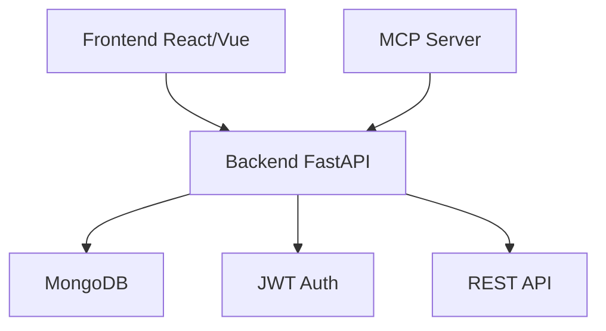

# 🏦 Control de Gastos App

**Sistema completo de gestión de finanzas personales** desarrollado con tecnologías modernas y arquitectura escalable.

<div align="center">
  


</div>

## 🎯 Descripción

Una aplicación completa para el control de finanzas personales que permitirá a los usuarios gestionar sus gastos, ingresos y ahorros de manera eficiente. El proyecto está estructurado en tres componentes principales:

- **Backend API** (✅ Completado)
- **Frontend Web** (🚧 En desarrollo)
- **MCP (Model Context Protocol)** (🚧 Planificado)

## 🏗️ Arquitectura del Sistema



## 📁 Estructura del Proyecto

```
control-gastos-app/
├── backend/               # ✅ API Backend (FastAPI + MongoDB)
│   ├── api/              # Endpoints REST
│   ├── core/             # Configuración y seguridad
│   ├── db/               # Conexión a base de datos
│   ├── models/           # Modelos y esquemas
│   ├── services/         # Lógica de negocio
│   ├── main.py           # Aplicación principal
│   └── README.md         # Documentación del backend
├── frontend/             # 🚧 Interfaz Web (React/Vue)
│   └── README.md         # (En desarrollo)
├── mcp/                  # 🚧 Model Context Protocol
│   └── README.md         # (Planificado)
└── README.md             # Este archivo
```

## 🚀 Características Implementadas

### ✅ Backend API
- **Autenticación JWT** completa (registro, login, perfil)
- **Gestión de gastos** con categorías y tipos de pago
- **Control de ingresos** con fuentes personalizables
- **Seguimiento de ahorros** con metas y propósitos
- **Estadísticas financieras** y reportes mensuales
- **Seguridad robusta** con validaciones y encriptación
- **Documentación automática** con Swagger/OpenAPI
- **Arquitectura limpia** con separación de responsabilidades

### 🚧 En Desarrollo
- **Frontend Web**: Interfaz de usuario moderna y responsiva
- **MCP Server**: Protocolo para integración con herramientas de IA

## 🛠️ Tecnologías

### Backend
- **FastAPI** - Framework web moderno y rápido
- **MongoDB** - Base de datos NoSQL flexible
- **ODMantic** - ODM moderno para MongoDB
- **Pydantic** - Validación de datos con tipos
- **JWT** - Autenticación con tokens
- **Scrypt** - Hash seguro de contraseñas
- **Uvicorn** - Servidor ASGI de alta performance

### Frontend (Planificado)
- **React/Vue.js** - Framework de interfaz de usuario
- **TypeScript** - Tipado estático
- **Tailwind CSS** - Framework de estilos
- **Axios** - Cliente HTTP
- **Chart.js** - Gráficos y visualizaciones

### MCP (Planificado)
- **Model Context Protocol** - Integración con herramientas de IA
- **Python** - Servidor MCP personalizado

## 🏃‍♂️ Inicio Rápido

### Prerequisitos
- Python 3.11+
- MongoDB 4.4+
- Node.js 18+ (para frontend)
- Git

### 1. Clonar el repositorio
```bash
git clone https://github.com/sergiodev3/control-gastos-app.git
cd control-gastos-app
```

### 2. Configurar el Backend
```bash
cd backend

# Crear entorno virtual
python -m venv .venv

# Activar entorno virtual
.venv\Scripts\activate  # Windows
# source .venv/bin/activate  # Linux/macOS

# Instalar dependencias
pip install -r requeriments.txt

# Iniciar servidor
uvicorn main:app --reload --host 0.0.0.0 --port 8000
```

La API estará disponible en:
- **Servidor**: http://localhost:8000
- **Documentación**: http://localhost:8000/docs

### 3. Configurar el Frontend (Cuando esté disponible)
```bash
cd frontend
npm install
npm run dev
```

## 📚 Documentación Detallada

- [📖 Documentación del Backend](./backend/README.md)
- [🎨 Documentación del Frontend](./frontend/README.md) *(En desarrollo)*
- [🤖 Documentación del MCP](./mcp/README.md) *(Planificado)*

## 🧪 Probar la API

### Endpoints Principales

#### 🔐 Autenticación
```bash
# Registrar usuario
POST http://localhost:8000/api/v1/auth/register
{
  "email": "usuario@example.com",
  "username": "miusuario",
  "full_name": "Mi Nombre",
  "password": "password123"
}

# Iniciar sesión
POST http://localhost:8000/api/v1/auth/login
{
  "email": "usuario@example.com", 
  "password": "password123"
}
```

#### 💸 Gestión Financiera
```bash
# Crear gasto
POST http://localhost:8000/api/v1/expenses
Authorization: Bearer <token>
{
  "description": "Supermercado",
  "amount": 150.75,
  "payment_type": "tarjeta_debito",
  "category": "Alimentación"
}

# Ver estadísticas
GET http://localhost:8000/api/v1/stats/summary
Authorization: Bearer <token>
```

## 🎨 Capturas de Pantalla

### API Documentation (Swagger)


### Frontend (Próximamente)


## 🗺️ Roadmap

### ✅ Fase 1 - Backend API (Completado)
- [x] Arquitectura base con FastAPI
- [x] Autenticación JWT
- [x] CRUD completo de gastos, ingresos y ahorros
- [x] Estadísticas y reportes
- [x] Documentación completa

### 🚧 Fase 2 - Frontend Web (En desarrollo)
- [ ] Interfaz de usuario moderna
- [ ] Dashboard financiero
- [ ] Gráficos y visualizaciones
- [ ] Gestión de categorías
- [ ] Exportación de datos

### 🚧 Fase 3 - MCP Integration (Planificado)
- [ ] Servidor MCP personalizado
- [ ] Integración con herramientas de IA
- [ ] Análisis automático de gastos
- [ ] Recomendaciones inteligentes

### 🚀 Fase 4 - Características Avanzadas
- [ ] Aplicación móvil (React Native)
- [ ] Notificaciones push
- [ ] Sincronización con bancos
- [ ] Múltiples monedas
- [ ] Reportes PDF

## 📊 Estado del Desarrollo

| Componente | Estado | Progreso | Última Actualización |
|------------|--------|----------|---------------------|
| Backend API | ✅ Completado | 100% | Octubre 2025 |
| Frontend Web | 🚧 En desarrollo | 0% | - |
| MCP Server | 🚧 Planificado | 0% | - |
| Documentación | ✅ Completado | 90% | Octubre 2025 |
| Testing | 🚧 En progreso | 30% | - |

## 🤝 Contribuir

¡Las contribuciones son bienvenidas! Por favor:

1. Fork el proyecto
2. Crear rama para feature (`git checkout -b feature/nueva-caracteristica`)
3. Commit cambios (`git commit -m 'Agregar nueva característica'`)
4. Push a la rama (`git push origin feature/nueva-caracteristica`)
5. Crear Pull Request

### Áreas donde necesitamos ayuda:
- 🎨 Diseño UX/UI para el frontend
- 📱 Desarrollo móvil
- 🧪 Testing y QA
- 📖 Documentación y tutoriales
- 🌐 Internacionalización

## 📄 Licencia

Este proyecto está bajo la Licencia MIT. Ver archivo [LICENSE](LICENSE) para más detalles.

## 👨‍💻 Autor

**Sergio** - [@sergiodev3](https://github.com/sergiodev3)

## 🙏 Agradecimientos

- [FastAPI](https://fastapi.tiangolo.com/) por el excelente framework
- [MongoDB](https://www.mongodb.com/) por la base de datos flexible
- [ODMantic](https://art049.github.io/odmantic/) por el ODM moderno
- La comunidad open source por las herramientas increíbles

## 📞 Contacto

- GitHub: [@sergiodev3](https://github.com/sergiodev3)
- Email: sergio.sanchez@cbtis258.edu.mx

---

<div align="center">

**¡Desarrollado con ❤️ y ☕ para el control financiero personal!**

[⭐ Dale una estrella si te gusta el proyecto](https://github.com/sergiodev3/control-gastos-app)

</div>