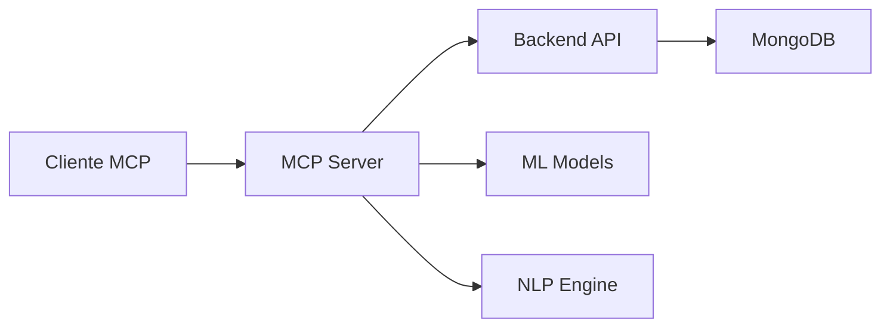

# 🤖 MCP Server - Control de Gastos

> **Estado**: 🚧 Planificado

Servidor de Model Context Protocol para integración con herramientas de IA y análisis inteligente de finanzas.

## 🎯 Objetivos

- Integración con herramientas de IA como Claude, ChatGPT, etc.
- Análisis inteligente de patrones de gastos
- Recomendaciones automáticas de ahorro
- Categorización automática de transacciones
- Alertas inteligentes de presupuesto

## 🛠️ Tecnologías Planificadas

- **Python** - Lenguaje principal
- **MCP Protocol** - Model Context Protocol
- **FastAPI** - Para endpoints adicionales
- **MongoDB** - Integración con la base de datos principal
- **Machine Learning** - Para análisis de patrones
- **NLP** - Procesamiento de descripciones de gastos

## 📋 Características Planificadas

### 🤖 Integración con IA
- [ ] Servidor MCP compatible
- [ ] Conectividad con Claude Desktop
- [ ] Integración con ChatGPT
- [ ] Soporte para otros LLMs

### 📊 Análisis Inteligente
- [ ] Categorización automática de gastos
- [ ] Detección de patrones de gasto
- [ ] Predicción de gastos futuros
- [ ] Análisis de tendencias

### 💡 Recomendaciones
- [ ] Sugerencias de ahorro
- [ ] Optimización de presupuesto
- [ ] Alertas de gastos inusuales
- [ ] Metas financieras inteligentes

### 🔧 Herramientas MCP
- [ ] `get_financial_summary` - Resumen financiero
- [ ] `analyze_spending_patterns` - Análisis de patrones
- [ ] `suggest_budget_optimization` - Optimización de presupuesto
- [ ] `categorize_transaction` - Categorización automática
- [ ] `set_smart_goals` - Metas inteligentes

## 🚀 Arquitectura Planificada

## 📝 Casos de Uso

### Para Usuarios
- **Consulta Natural**: "¿Cuánto gasté en restaurantes este mes?"
- **Análisis**: "Analiza mis patrones de gasto del último trimestre"
- **Recomendaciones**: "¿Cómo puedo ahorrar más dinero?"
- **Planificación**: "Ayúdame a crear un presupuesto para el próximo mes"

### Para Herramientas de IA
- Acceso directo a datos financieros
- Capacidades de análisis avanzado
- Generación de insights automáticos
- Integración transparente con conversaciones

## 🔮 Visión Futura

### Fase 1 - MCP Básico
- [ ] Servidor MCP funcional
- [ ] Herramientas básicas de consulta
- [ ] Integración con backend existente

### Fase 2 - Análisis Inteligente
- [ ] Modelos de ML para categorización
- [ ] Análisis de patrones de gasto
- [ ] Recomendaciones básicas

### Fase 3 - IA Avanzada
- [ ] Predicciones de gastos futuros
- [ ] Optimización automática de presupuestos
- [ ] Alertas inteligentes personalizadas

### Fase 4 - Ecosistema Completo
- [ ] Integración con múltiples LLMs
- [ ] API pública para desarrolladores
- [ ] Marketplace de herramientas MCP

## 🤝 Contribuir

¿Tienes experiencia con MCP o Machine Learning? ¡Tu ayuda será invaluable!

### Áreas de Contribución
- 🧠 **Machine Learning**: Modelos de categorización y predicción
- 🔧 **MCP Development**: Implementación del protocolo
- 📊 **Data Science**: Análisis de patrones financieros
- 🧪 **Testing**: Pruebas de integración con herramientas de IA

## 📞 Estado Actual

Este componente está en fase de investigación y planificación. 

Actualmente puedes:
1. Usar la API REST directamente: [Backend API](../backend/README.md)
2. Probar endpoints en: [http://localhost:8000/docs](http://localhost:8000/docs)

## 🔗 Referencias

- [Model Context Protocol](https://modelcontextprotocol.io/)
- [Claude Desktop MCP](https://claude.ai/docs/mcp)
- [MCP Servers](https://github.com/modelcontextprotocol/servers)

---

**¿Interesado en el futuro de la IA en finanzas personales?** ¡Síguenos para actualizaciones!